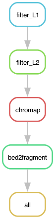

Evalution of latch.bio's Snakemake [integration](https://docs.latch.bio/manual/snakemake.html)
for the ATX ATAC-seq fastq2frags pipeline (snaTAC).  For the original Snakemake pipeline and documentation see [ATX_ATAC-seq](https://github.com/atlasxomics/ATX_ATAC-seq/tree/main); for the Latch SDK implementation, see [spatial-atacseq_latch](https://github.com/atlasxomics/spatial-atacseq_latch).

  

### parameters

* **read 1**: fastq.gz containing R1 from a epigenomic DBiT-seq experiment with barcoding schema according to Zheng, 2023.
* **read 2**: fastq.gz containing R2 from a epigenomic DBiT-seq experiment with barcoding schema according to Zheng, 2023.
* **reference genome pointer**: text file containing file path to reference genome directory on the Latch File system; for information on creating a new reference genome, see Chromap [docs](https://github.com/haowenz/chromap#general).
* **barcode file**: text file listing barcodes used in the experiment. 
